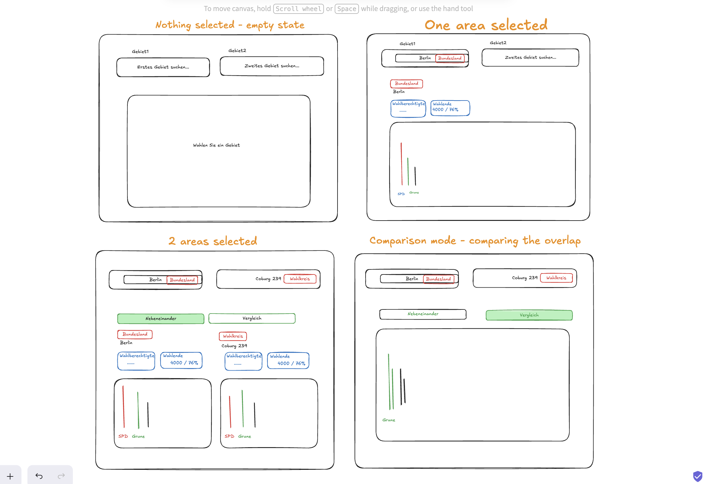

# Bundestagswahl 2025 Results Explorer

Hello Team!

Here is a small React + TypeScript SPA for exploring the official results of the 2025 German federal election. A user can pick an electoral area (Bundesgebiet, Land, or Wahlkreis), see its results, then pick a second area to compare side-by-side or in a combined diagram.

## Deployed version

[bundestagswahl-2025-results-explore.vercel.app](https://bundestagswahl-2025-results-explore.vercel.app/)


## Run locally

```bash
npm install
npm run dev
```

Other scripts: `npm run build`, `npm run lint`, `npm test`.


## Time spent

Around 3 evenings + polishing


## App structure design

I used Excalidraw to visualize the states of the future app:




## Tech stack
  
  - **Vite** over Next.js — this is a fully client-side application.
  - **shadcn + TailwindCSS** for styling — a combo I've used before.
  - **Recharts** for charts — lightweight, made for the web, and has built-in accessibility (bars are tabbable and tooltip results are read by VoiceOver).


## Data

Source: [Bundeswahlleiterin Open Data, BTW 2025](https://www.bundeswahlleiterin.de/bundestagswahlen/2025/ergebnisse/opendata.html).

I only used `kerg2.csv` and not `Gebietsnummern-und-namen.csv` additionally, since the names of the areas can be derived from `kerg2.csv`. I kept the data file in `public/data/` as a fixture and fetch it at runtime — faster to implement and avoids CORS. Parsing happens in the browser with PapaParse.

The trickiest part was deciding how to transform the data. First I thought to group the rows by Land name:

```ts
const electionData = {
  Hamburg: {
    Gebietsart: "Land",
    Name: "Hamburg",
    Gruppen: [{ Gruppenname: "SPD", Anzahl: "123123" }],
    // ...
  },
  "Nordrhein-Westfalen": {
    /* ... */
  },
  // ...
};
```

But this would drop areas with identical names but different `Gebietsart` (e.g. _Hamburg_ the Land vs. _Hamburg-Mitte_ the Wahlkreis).

So I identify each area by `[areaType]-[areaName]` (`Land-Hamburg`, `Wahlkreis-Hamburg-Mitte`). This format is convenient for two reasons:                                                                                                            
                                                                                                                                            
  1. URL search params — the keys can be stored directly in the URL.                                                 
  2. Data lookup — I decided to store data in a Map using these keys, which guarantees that the keys are unique, and provides fast lookups for the autocomplete.


## What I built

- **Search with autocomplete** for any of the 316 areas.
- **Area performance** — analyse the turnout and voting results for up to two areas side by side with graphs and tables.
- **Comparison mode** — compare the performance of parties in different areas.
- **Shareable URLs** — the current selection state lives in the URL.
- **Light/dark theme toggle** — a quick solution to switch between themes.


## UX Decisions

### Single / Double Column View                                                                                                          
                                                                                                                                            
  A chart shows parties on the x-axis and their share of total votes (%) on the y-axis, sorted from highest to lowest (left to right).
  Because the default view is very restrictive in the individual charts width, I decided to only show the parties with more than 5% of total votes.        
                                                                                                                                            
### Comparison View                                           
                                                                                                                                            
  When comparing two locations, I had to choose between two approaches:                                                                     
   
  1. Compare by rank — e.g. the top party in Location A (SPD) against the top party in Location B (CDU), even if they're different parties. 
  2. Compare by party — show each party's performance side-by-side across both locations.
                                                                                                                                            
  I chose option 2, since highlighting how a single party performs across locations felt more insightful. Rank-based comparisons (1st, 2nd, 
  3rd place) are already easy to read from the table. I also validated this choice with a potential user (a friend) to confirm it matched   
  their expectations when toggling comparison mode.    

### Table

In the chart I only show the parties with more than 5% of total votes. In order to still deliver the full information to the user, I decided to add a table that contains the complete voting results.
I did not add a table for the comparison view, since I reasoned that all raw results are already accessible in the default view.


## Accessibility Testing

I used the VoiceOver program pre-installed on my Mac to test screen reader accessibility of the web app. A brief test yielded good usability results, as the most important data points are understandable and a search can be performed.


## Architecture

Three layers:

- **`src/domain/`** — types (`ElectionCsvRow`, `AreaResults`, `PartyResult`), constants, and a `mapParsedResults` transform that turns raw CSV rows into a keyed `Map<string, AreaResults>`.
- **`src/data/`** — `loadElectionData()` fetches the CSV and runs it through a generic `parseCsv<T>()` helper.
- **`src/presentation/`** — React. An `ElectionDataContext` holds and shares the election data state `{status, data, error}`; `useElectionData()` consumes it.
`useAreaSelection()` hook handles the setting of URL search params and provides data of the selected area.
 Components live under `components/`, with shadcn primitives in `components/ui/`.

Data flow: `main.tsx` → `BrowserRouter` + `ElectionDataProvider` → `App.tsx` → components consume via `useElectionData()`.

## Tests

A couple of tests cover the most important functionality:

- CSV parsing
- Domain mapping — if `mapParsedResults()` correctly groups rows by a unique `areaType-areaName` key, extracts turnout data, and only considers second-vote data
- Number formatting — checks `toGermanNumber` and `toGermanPercent` produce correctly localized German output.
- Autocomplete filtering behaviour
- Error states — invalid area key in URL search params, and network/loading failure of the CSV data.
- Empty state — no results match the current selection or search query.
- Loading state — shown while `loadElectionData()` is in flight.


## Left out

- Previous-election (2021) deltas, column swap button, and session persistence — left out in order to focus on the main features while staying within time constraints.
